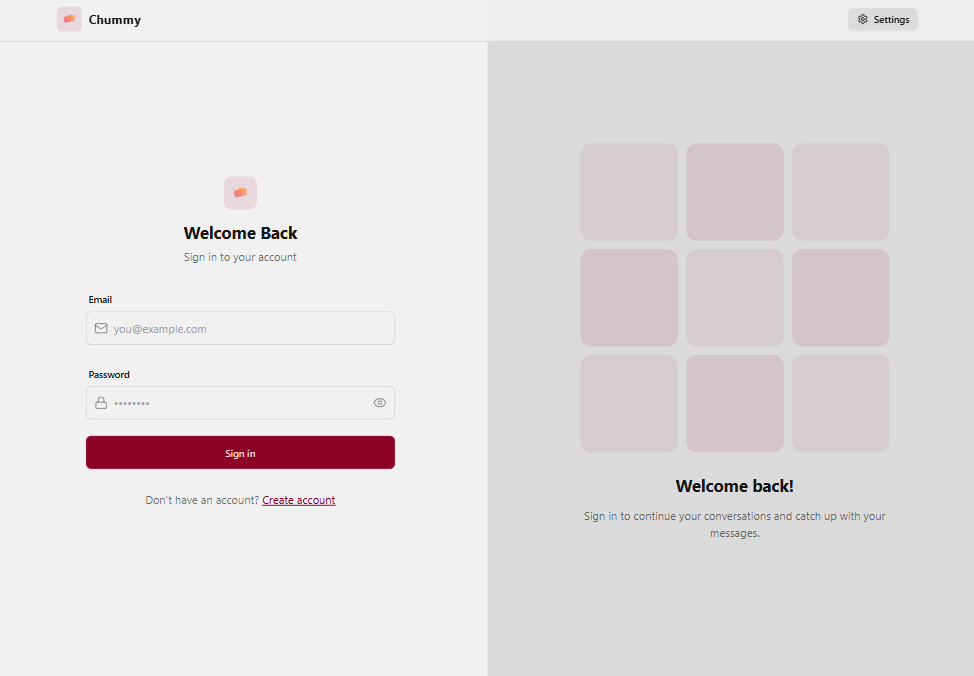
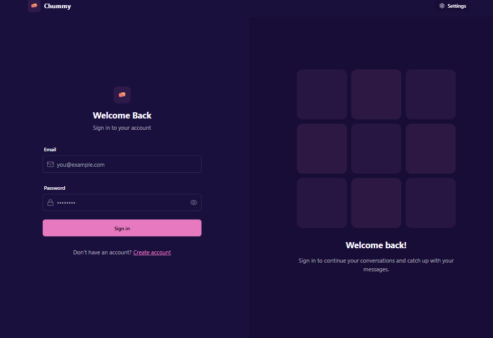
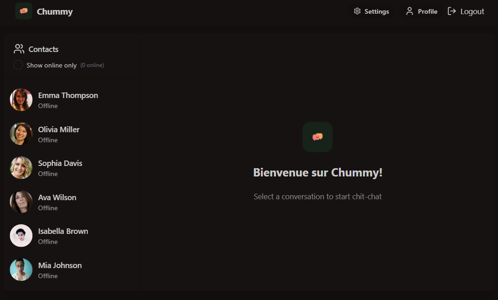
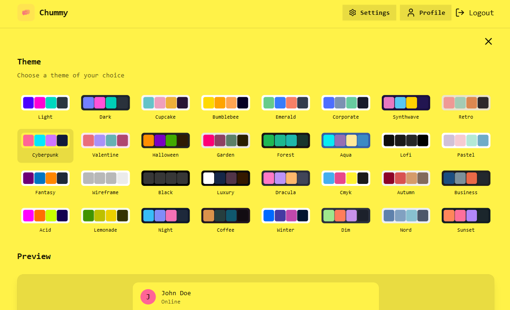
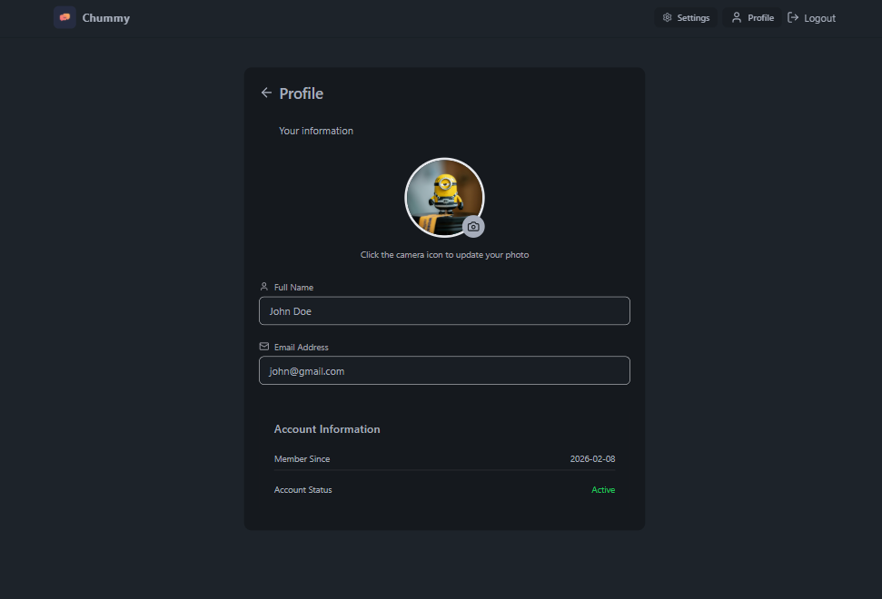

# Chummy

[](https://github.com/Harshitpant12/chummy-chat)
[](https://mongodb.com)
[](./LICENSE)

**Chummy** is a modern, fast, and user-friendly real-time chat application built with the MERN stack (MongoDB, Express.js, React, Node.js). It features secure authentication, real-time UI updates, a scalable production-ready architecture, and a wide range of customizable themes to enhance user experience.

---

## Live Demo

[**View Live Application**](https://chummy.onrender.com/)  
_(Note: The backend is hosted on a free tier, so the initial request may take 30-60 seconds to spin up.)_

---

## Key Features

- **Secure Authentication System:** Implements JWT-based authentication with HTTP-only cookie storage, bcrypt password hashing, protected routes, and secure session validation to ensure safe and reliable user access.
- **Real-Time Messaging:** Enables instant message delivery and live UI synchronization to provide a seamless, interactive chat experience without manual refresh.
- **Multiple Theme Options:** Offers customizable UI themes with a clean, responsive design to enhance user experience and accessibility across devices.
- **Full-Stack MERN Architecture:** Built using MongoDB, Express.js, React, and Node.js with a structured API layer, efficient state management, and optimized database operations for performance and scalability.
- **Responsive Design:** Fully responsive interface optimized for desktop and mobile devices, ensuring consistent usability across different screen sizes.
- **Production-Ready Structure:** Designed with a scalable backend architecture, modular code organization, environment-based configuration, and maintainable project structure suitable for real-world deployment.

---

## Tech Stack

### Frontend

- **React.js (Vite)**: Modern, component-based UI library with fast bundling.
- **Tailwind CSS**: Utility-first CSS framework for responsive and maintainable styling.
- **Context API**: Global state management for authentication and user state.
- **Axios**: HTTP client with interceptors for automatic token injection.

### Backend

- **Node.js & Express.js**: RESTful API server with modular controllers and routes.
- **MongoDB & Mongoose**: NoSQL database with schema validation and efficient data modeling.
- **JWT (JSON Web Tokens)**: Stateless authentication with HTTP-only cookies for security.
- **Bcrypt.js**: Industry-standard password hashing.
- **Express-Validator**: Server-side input validation and sanitization.
- **dotenv & CORS**: Environment configuration and cross-origin request handling.

---

## Screenshots

|                    Login                     |                     SignUp                      |
| :------------------------------------------: | :---------------------------------------------: |
|        |         |
|                  Dashboard                   |                 Chat Dashboard                  |
|       |          |
|                   Settings                   |                     Profile                     |
|  |  |

---

## Architecture & Project Structure

The project follows a **MVC (Model-View-Controller)** pattern adapted for modern full-stack development.

```bash
Chummy/
├── backend/
│   ├── src/
│   │   ├── controllers/   # Request logic & business rules
│   │   ├── lib/           # Utility functions and helpers
│   │   ├── middleware/    # Auth checks & error handling
│   │   ├── models/        # Mongoose schemas (User, Message)
│   │   ├── routes/        # API endpoints definition
│   │   ├── seeds/         # Sample users for database initialization
│   │   └── index.js       # App entry point
└── frontend/
    ├── public/             # Static files
    ├── src/
    │   ├── components/     # Reusable UI components
    │   ├── constants/      # Themes array and configuration exports
    │   ├── lib/            # Axios configuration and helpers
    │   ├── pages/          # View pages (Login, Chat)
    │   ├── store/          # Context API for global state management
    │   ├── App.jsx         # Main routing logic
    │   ├── main.jsx        # Frontend entry point
    │   └── index.css       # Global styles

```

---

## Installation & Setup

Follow these steps to run the project locally.

### Prerequisites

- **Node.js** (v14+)
- **MongoDB** (Local instance or MongoDB Atlas URL)
- **Git**

### 1. Clone the Repository

```bash
git clone https://github.com/Harshitpant12/chummy-chat.git
cd chummy-chat
```

### 2. Backend Setup

Navigate to the backend folder and install dependencies:

```bash
cd backend
npm install
```

Create a `.env` file in the `backend/` root folder with the following variables:

```env
PORT=5001
MONGO_URI=your_mongodb_connection_string
JWT_SECRET=your_super_secret_random_key
CLOUDINARY_CLOUD_NAME=your_cloudinary_cloud_name
CLOUDINARY_API_KEY=your_cloudinary_api_key
CLOUDINARY_API_SECRET=your_cloudinary_api_secret
NODE_ENV=development
```

Start the backend server:

```bash
npm run dev
```

_The server should run on http://localhost:5001_

### 3. Frontend Setup

Open a new terminal window, navigate to the frontend folder, and install dependencies:

```bash
cd frontend
npm install
```

Start the React development server:

```bash
npm run dev
```

_The app should now be live on http://localhost:5173_

---

## API Reference

### Auth Routes

| Method   | Endpoint                   | Description                                  | Protected? |
| -------- | -------------------------- | -------------------------------------------- | :--------: |
| **POST** | `/api/auth/signup`         | Register a new user                          |     ❌     |
| **POST** | `/api/auth/login`          | Authenticate user & issue token              |     ❌     |
| **POST** | `/api/auth/logout`         | Logout user and clear authentication         |     ✅     |
| **PUT**  | `/api/auth/update-profile` | Update user profile information              |     ✅     |
| **GET**  | `/api/auth/check`          | Verify current user session & authentication |     ✅     |

### Message Routes

| Method   | Endpoint                 | Description                           | Protected? |
| -------- | ------------------------ | ------------------------------------- | :--------: |
| **GET**  | `/api/messages/users`    | Get all users for the sidebar         |     ✅     |
| **GET**  | `/api/messages/:id`      | Get all messages with a specific user |     ✅     |
| **POST** | `/api/messages/send/:id` | Send a new message to a user          |     ✅     |

---

## Contributing

Contributions are welcome!

1.  **Fork** the project.
2.  Create your **Feature Branch** (`git checkout -b feature/AmazingFeature`).
3.  **Commit** your changes (`git commit -m 'Add some AmazingFeature'`).
4.  **Push** to the Branch (`git push origin feature/AmazingFeature`).
5.  Open a **Pull Request**.

---

## License

Distributed under the **MIT License**. See `LICENSE` for more information.
